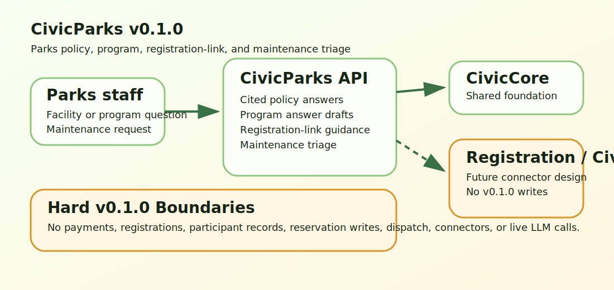

# CivicParks User Manual

## Non-Technical Staff

CivicParks helps parks and recreation staff prepare cited policy answers, answer program and facility questions, draft registration guidance that links residents to existing systems, and triage maintenance requests for staff review.

Staff remain responsible for every answer, registration note, facility rule, and maintenance handoff. CivicParks does not process payments, enroll participants, manage participant records, reserve facilities, dispatch crews, replace Civic311, or replace recreation registration systems.

## IT / Technical

Install with:

```bash
python -m pip install -e ".[dev]"
python -m uvicorn civicparks.main:app --host 127.0.0.1 --port 8143
```

Runtime dependency: `civiccore==0.2.0`.

Primary endpoints:

- `GET /health` - service and CivicCore version.
- `GET /civicparks` - public sample UI.
- `POST /api/v1/civicparks/policy-answer` - cited parks policy answer draft.
- `POST /api/v1/civicparks/program-answer` - program and facility answer draft.
- `POST /api/v1/civicparks/registration-assistance` - registration-link guidance draft.
- `POST /api/v1/civicparks/maintenance-triage` - Civic311-style maintenance triage draft.

## Architecture



CivicParks is a module on top of CivicCore. v0.1.0 is deterministic and local: no payments, registration writes, participant records, reservation writes, work-order creation, crew dispatch, live LLM calls, or connector runtime is shipped.
